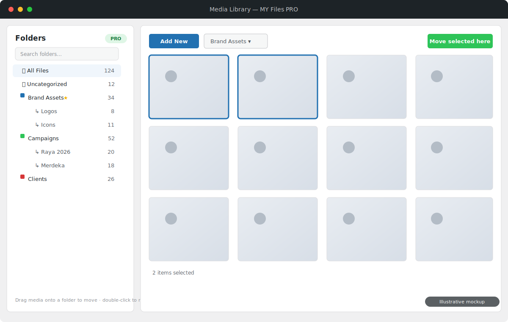
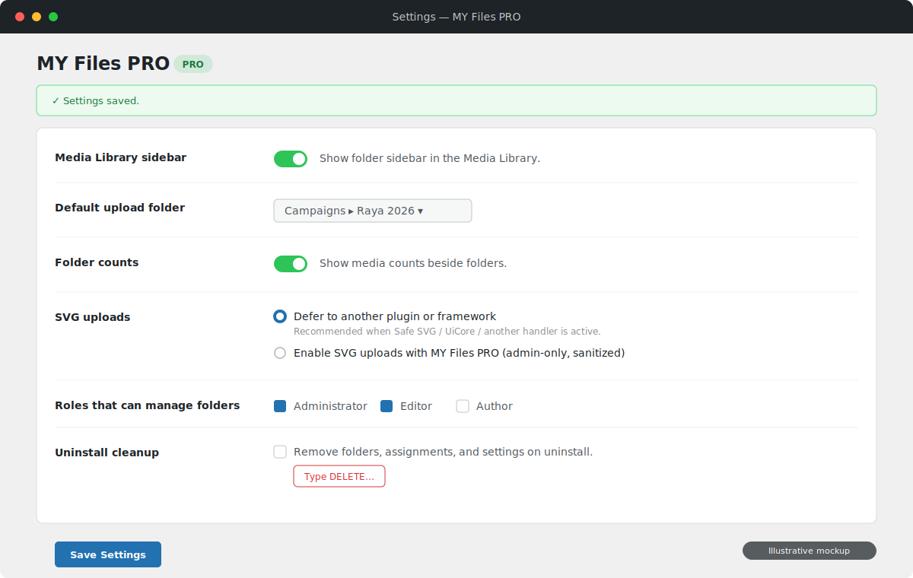

# MY Files PRO

MY Files PRO is an open-source WordPress media-library folder plugin. It organizes
attachments into nested folders using a private hierarchical taxonomy, then adds
folder filtering, assignment, bulk moves, import/export, and role-aware controls
inside the WordPress admin.

[](https://github.com/AminudinMurad/my-files-pro/releases/latest)
[](LICENSE)

**MY Files PRO is free and open source under the GNU GPL v3.0 or later. If it helps you
organize your media library, please consider supporting continued development
and WordPress compatibility testing:**

[](https://github.com/sponsors/aminudinmurad)
[](https://ko-fi.com/aminudinmurad)
[](https://www.paypal.com/paypalme/aminudinmurad)

## Overview

The stock WordPress Media Library is a single flat list. MY Files PRO adds a
**folder sidebar** right where you upload and pick media, so you can organise
attachments into a nested hierarchy without moving a single file on disk —
folders are a private taxonomy, not physical directories, so nothing about your
existing URLs or files changes.

### Highlights

- **Folder sidebar** in the Media Library grid, list view, and the media picker modal.
- **Nested folders** — create, rename (double-click), delete, duplicate, drag to reorder or re-nest, and collapse/expand branches.
- **Favourites and colour labels** to keep frequently used folders findable.
- **Move media fast** — drag thumbnails onto a folder, or select many and *Move selected here*. **Quick Move Mode** skips the preview modal entirely.
- **Upload straight into the selected folder**, with a configurable default upload folder.
- **All Files** and **Uncategorized** views, plus optional media **counts** beside each folder.
- **Import / export** folders and assignments as JSON, with compatible CSV import.
- **Role-aware access** — choose which roles may manage folders (Administrator + Editor by default).
- **Optional, admin-only SVG uploads** with a conflict-safe mode that defers to Safe SVG / UiCore / other handlers when present.
- **Security-first** — REST endpoints gated by nonces and capability checks, per-attachment `edit_post` checks, validated imports, and opt-in uninstall cleanup.

Built on WordPress-native APIs (a hierarchical taxonomy, the REST API, and the
media modal) — no custom database tables, no third-party runtime dependencies.

## Screenshots

### Folder sidebar in the Media Library



### Settings



> Screenshots are illustrative mockups of the plugin interface.

## Requirements

- WordPress 7.0 or newer
- PHP 7.4 or newer
- A user role with `upload_files` for media access
- A user role with `manage_options` for plugin settings

## Installation

1. Download `my-files-pro-<version>.zip` from the [latest release](https://github.com/AminudinMurad/my-files-pro/releases/latest).
2. In WordPress admin, go to **Plugins → Add New → Upload Plugin** and upload the ZIP.
3. Activate **MY Files PRO**.
4. Open **Settings → MY Files PRO** to configure the sidebar, default upload folder, counts, SVG mode, roles, and uninstall cleanup.

## Using the plugin

1. Open the **Media Library** — the folder sidebar appears alongside the grid.
2. Create top-level or nested folders; rename with a double-click, and drag to reorder or re-nest.
3. Select a folder to filter the library to its media (or choose **All Files** / **Uncategorized**).
4. Move media by dragging thumbnails onto a folder, or select several and use **Move selected here**. Enable **Quick Move Mode** to select without opening the preview modal.
5. Upload while a folder is selected to place new files straight into it (subject to permissions and the default upload folder setting).
6. Export folders and assignments to JSON for backup or migration, and import JSON or a compatible CSV to restore them.

## Architecture

The plugin uses a custom **hierarchical taxonomy** (`myfiles_folder`) rather than a
custom database table. Taxonomy storage is the WordPress-native choice: it gives
attachment relationships, hierarchy, counts, term metadata, sanitization paths,
and query integration without maintaining custom SQL.

Main files:

- `my-files-pro.php` — bootstraps the plugin (constants, autoloader, hooks).
- `src/Autoloader.php` — first-party PSR-4-style autoloader for the `MyFilesPro\` namespace.
- `src/Plugin.php` — plugin coordinator and lifecycle.
- `src/Folders.php` — taxonomy registration, folder CRUD, ordering, assignment, import, export.
- `src/Media.php` — folder filtering for Media Library queries and uploads.
- `src/RestApi.php` — folder and attachment actions for the admin UI.
- `src/Settings.php` — renders and saves plugin settings.
- `src/SvgUploads.php` — opt-in SVG upload support, only when the managed SVG setting is enabled.
- `src/ImportExport.php` — JSON admin import/export and compatible CSV imports.
- `src/Assets.php` — loads admin CSS/JS only where needed.
- `src/Admin.php` — admin helpers and a list-view filter fallback.
- `src/Uninstall.php` — removes data only when uninstall cleanup is enabled.
- `assets/js/admin.js`, `assets/css/admin.css` — the Media Library folder interface.

## REST endpoints

Namespace: `/wp-json/my-files-pro/v1`

- `GET /folders`
- `POST /folders`
- `POST|PUT|PATCH /folders/{id}`
- `DELETE /folders/{id}`
- `POST /folders/{id}/duplicate`
- `POST /folders/order`
- `POST /attachments/move`
- `GET /settings`
- `POST /settings`

## Security

- Folder management requires `upload_files` plus an allowed role from settings (default non-admin manager role: Editor); settings and import/export require `manage_options`.
- REST requests use the WordPress REST nonce; inputs are validated and sanitized; admin output is escaped.
- Attachment moves check `edit_post` per attachment; folder deletion stops on media the current user cannot edit.
- Requested upload destinations require folder-manager permission; non-managers only receive the configured default upload folder.
- JSON and CSV imports are bounded by file size, folder count, and assignment count.
- SVG uploads default to "Defer to another plugin or framework" (no hooks registered); the optional managed mode is administrator-only and sanitizes SVG files before WordPress accepts them.
- Uninstall cleanup is opt-in and requires typing `DELETE` to enable.

See [`SECURITY.md`](SECURITY.md) for the reporting policy.

## Local development

```bash
git clone https://github.com/AminudinMurad/my-files-pro.git
cd my-files-pro
```

Symlink or copy the project into `wp-content/plugins/my-files-pro`, then activate
**MY Files PRO** in WordPress.

Run the dependency-free source checks and behavior tests before publishing a change:

```bash
bash tools/check.sh
```

This runs the PHP 7.4 compatibility guard, PHP/JS syntax checks, version-metadata
coherence, and the `tests/` behavior suite.

## Repository layout

- `my-files-pro.php`, `index.php`, `uninstall.php` — plugin bootstrap and guards
- `src/` — PHP classes (`MyFilesPro\` namespace)
- `assets/` — first-party, screen-scoped admin CSS/JavaScript
- `readme.txt` — WordPress-style readme + changelog (`Stable tag`)
- `tests/` — dependency-free WordPress stubs and behavior tests
- `tools/check.sh` — source, compatibility, and behavior checks
- `tools/check-php74-compat.php` — PHP 7.4 syntax/API compatibility guard
- `docs/screenshots/` — illustrative README mockups (excluded from the package)
- `LICENSE`, `README.md`, `CONTRIBUTING.md`, `SECURITY.md` — project docs

## Releases

Releases are built and verified locally. Run `bash tools/check.sh`, build only the
files allowed by `.distignore` into a `my-files-pro/`-rooted archive
(`releases/my-files-pro-<version>.zip`), verify the archive root and contents, then
create the Git tag and GitHub Release with the verified ZIP. The local `releases/`
folder is ignored by Git and excluded from package inputs.

Version references must agree in:

- `my-files-pro.php` (header `Version` + `MY_FILES_PRO_VERSION`)
- `readme.txt` (`Stable tag`)
- the Git tag

## Support development

MY Files PRO is free to use. Optional tips and other support help fund continued
development, WordPress and PHP compatibility testing, and new features:

- [GitHub Sponsors](https://github.com/sponsors/aminudinmurad) — recurring support
- [Ko-fi](https://ko-fi.com/aminudinmurad) — quick one-time support
- [PayPal](https://www.paypal.com/paypalme/aminudinmurad) — direct support

Thank you for helping keep MY Files PRO improving and freely available.

## License

MY Files PRO is free software released under the GNU General Public License v3.0 or later. See [`LICENSE`](LICENSE).
You are free to use, study, modify, and redistribute the software — including commercially — provided that any distributed copies or derivative works remain under the GPL, retain the original copyright and license notices, and make their source code available.
